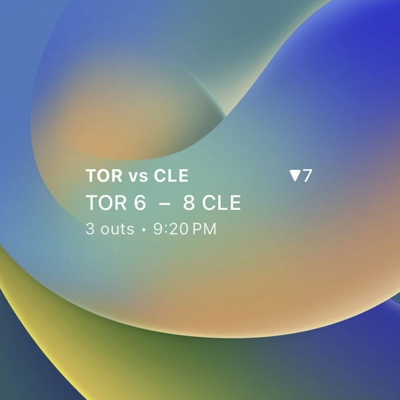
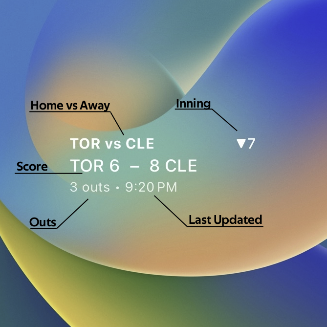
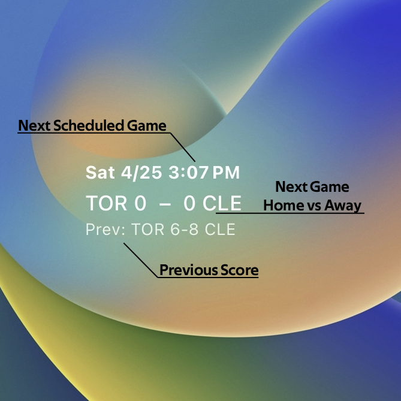
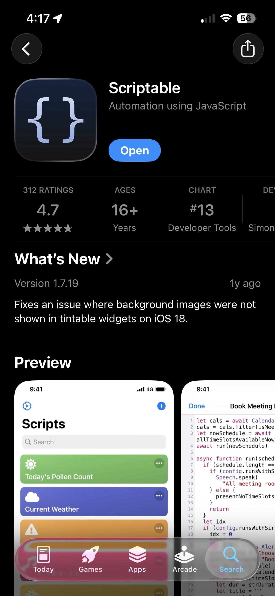
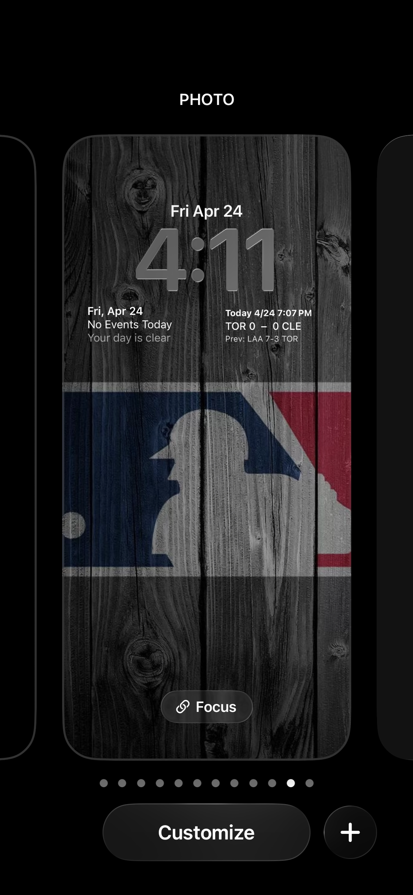
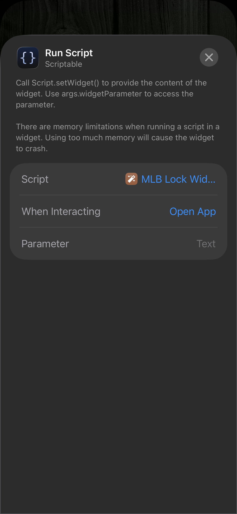
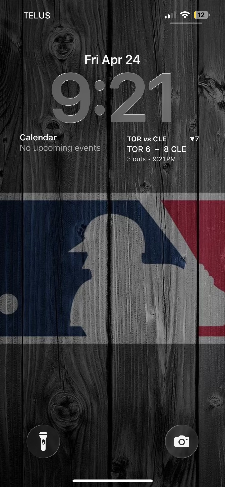

# MLB Lock Widget

MLB Lock Widget is an iOS/iPadOS Lock Screen widget for [Scriptable](https://scriptable.app/) that shows the current score of an MLB team at a glance.

When your team is playing, it switches into a live* scoreboard view. When they are off or the game has not started yet, it shows the next scheduled game and the previous game's result instead.



## What It Does

- Shows the live score, inning, and outs during games

- Shows the next scheduled game and previous score when no game is live

- Opens [MLB Gameday](https://www.mlb.com/gameday/) when you tap the widget

## Install

### 1. Install Scriptable

Download and install the [Scriptable](https://apps.apple.com/us/app/scriptable/id1405459188) app on your iPhone or iPad.



### 2. Create the Script

In Scriptable:

1. Create a new script.
2. Copy the contents of `scriptable.js` into it.
3. Save it with a name like `MLB Lock Widget`.

### 3. Configure Your Team

Edit the config values near the top of the script:

```javascript
const TEAM_ID = 141;
const FORCE_TIMEZONE = null;
```

- `TEAM_ID`: your MLB team ID
- `FORCE_TIMEZONE`: leave as `null` to use the device timezone, or set a timezone string like `"America/Toronto"`

  |IDs|Team|
  |---|---|
  |108|LAA|
  |109|ARI|
  |110|BAL|
  |111|BOS|
  |112|CHC|
  |113|CIN|
  |114|CLE|
  |115|COL|
  |116|DET|
  |117|HOU|
  |118|KC|
  |119|LAD|
  |120|WSH|
  |121|NYM|
  |133|OAK|
  |134|PIT|
  |135|SD|
  |136|SEA|
  |137|SF|
  |138|STL|
  |139|TB|
  |140|TEX|
  |141|TOR|
  |142|MIN|
  |143|PHI|
  |144|ATL|
  |145|CWS|
  |146|MIA|
  |147|NYY|
  |158|MIL|

### 5. Add the Widget to Your Lock Screen

1. Long-press the Lock Screen.
2. Tap `Customize`.



3. Tap the widget area underneath the clock and click `Scriptable`


4. Choose either the rectangular style.


5. Tap the widget and assign it to your saved script.



6. All done!



## Configuration Notes

These values can be adjusted if you want to tune behavior:

- `REFRESH_LIVE_MIN`: How often the widget requests to refresh during live games
- `REFRESH_IDLE_MIN`: How often the widget requests to refresh when idle
- `LOOKAROUND_DAYS`: How many days before and after today to fetch the next schedule
- `FORCE_TIMEZONE`: overrides the device timezone when set

## Disclaimers

`refreshAfterDate` is only a request to iOS/iPadOS, and does not guarantee an update will occur. This means this widget isn't perfectly live, and may be delayed by several minutes. The purpose of the widget is to simply keep you updated at a glance to know when your team is playing, and roughly what the current score is.

## Data Source

Game data comes from the public MLB Stats API:

- Schedule: `https://statsapi.mlb.com/api/v1/schedule`
- Live game feed: `https://statsapi.mlb.com/api/v1.1/game/{gamePk}/feed/live`
